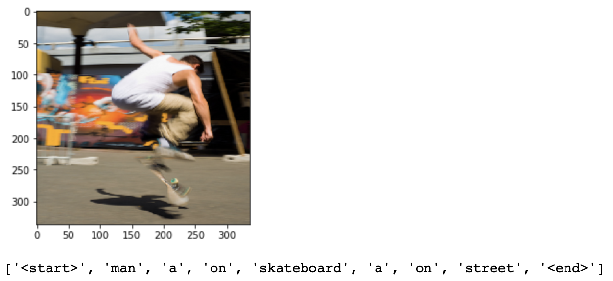

# Image_Captioning

Description
===========
This is project Image Captioning developed by team Learning Machine composed of Teng Ma, Shengzhe Zhang, Huaijin Wang, Yuchen Tang. Image captioning is a process of generating descriptive captions for given images. In our project, we will implement Image Captioning by the following process: First feed the image into a CNN, then use a RNN to leverage the images and their description sentences to learn latent relationsamong visual data and natural language. Our project is inspired by two papers, *Show and Tell and Show, Attend and Tell.*

The pre-trained model can be downloaded form [here](https://drive.google.com/open?id=1D31XAK71hzU4G9RCVLmQwV06pnpUmMFD)

Requirements
============
Code organization:  
1.create_input_data.py -- Preprocess and save the images and captions. 
2.get_train_log.ipynb -- Get the train information. 
3.image_caption.ipynb -- Run the training of our model. 
4.evaluate.ipynb -- Get the performance on test data. 
5.eval_sample.ipynb -- Run a demo of our code. 

**models.py**: contains encoders,decoders with attention and decoders without attention. 
**solvers.py**: contains train, validate, backprop, clip_grad, save_checkpoint...functions 
**create_input_data.py**: script used to fetch the MS COCO datasets. 
**train_script.py**: script used to train our model.

Results
============

Here are some captions generated on _test_ images by different models:

Vgg_NICA model:
---

Vgg_NIC model:
---

Resnet_NICA model:
---

---

---

Resnet_NIC model:
---

---

---

Densenet_NICA model:
---

---

---

Densenet_NIC model:
---

---

---

The loss and accuracy of each models.

vgg model
--

resnet model
--

densenet model
--

The BLEU score of each models.

resnet model
--

densenet model
--

